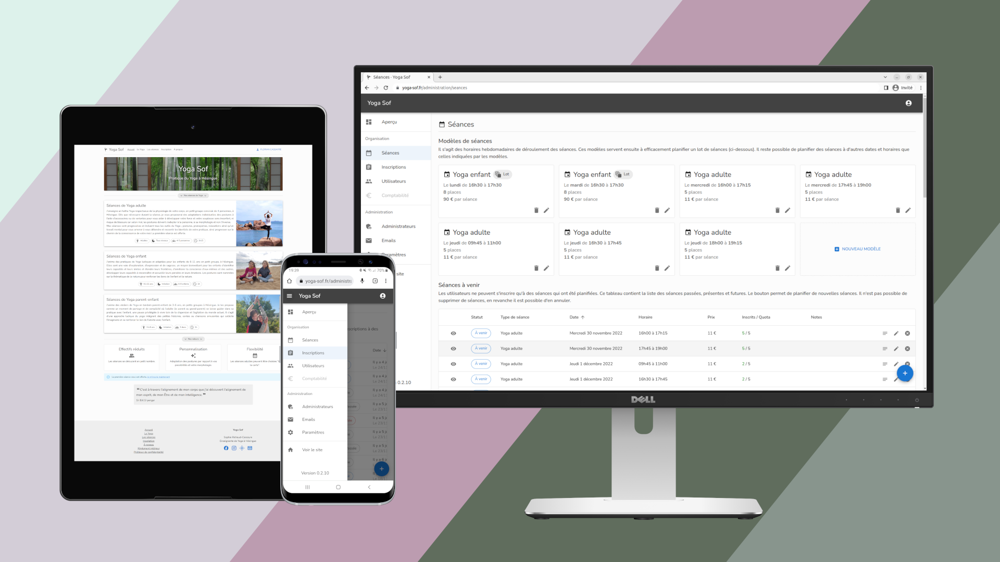

[yoga-sof.fr](https://yoga-sof.fr)
===

<p align="center">
  Website for the <b>Yoga Sof</b> organization
</p>

<p align="center">
  <i>Site pour l'organisation <b>Yoga Sof</b></i>
</p>



## Features

* Full-blown application that includes a front and a back-office
* Schedule classes and manage user reservations
* Email notification system
* Seamless integration with digital calendars
* Clean, affordable and responsive UI
* Easily customizable MDX files

## Technical details

The application was rewritten in November 2022.
Because of that, some parts are rough and are planned to be polished in the future.

### Stack

* [Next.js](https://nextjs.org/) ([Node.js](https://nodejs.org/) + [React](https://reactjs.org/))
* [MUI](https://mui.com/)
* [Prisma](https://www.prisma.io/)
* [tRPC](https://trpc.io/)
* [react-hook-form](https://react-hook-form.com/)
* [MDX](https://mdxjs.com/)

### Deployment

The production server should be started with the following command:

```
npm run run-production
```

The command essentially does the following:

* `git pull --ff-only` or `git clone git@github.com:FlorianCassayre/yoga-sof.fr.git` to fetch the source code
* Update or define `.env.production` according to the template `.env`
* `npm ci` to install the dependencies
* `npm run backup-production` to backup the current database, if there is any
* `npm run prisma-migrate-production` to run the database migration scripts
* `npm run generate-favicons` to generate the favicons
* `npm run build` to generate the production build (this operation consumes some memory, make sure the machine has enough)
* `npm run start-production` to start the production server

For a fresh install, you can additionally run `npx dotenv -e .env.production` to populate the
database with the initial whitelisted email addresses, as defined in `SEED_EMAILS_ADMIN`.

For a normal update, you may use the command `npm run update-production`. This command assumes that both the favicon and the environment did not change.

## Licensing

The source code is made available under the terms of the MIT license.

Please do not reuse the name of our association ("Yoga Sof"), or reuse the photos in an inappropriate way.

If you are interested in having a similar website, contact us at contact[at]yoga-sof[dot]fr
